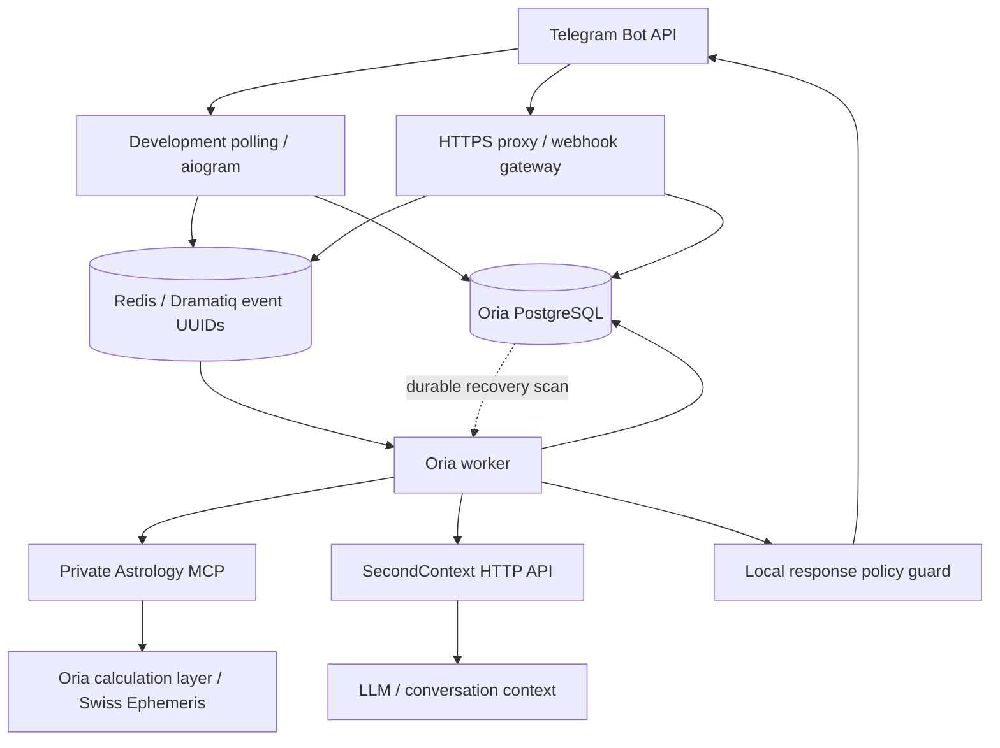

# Implemented architecture

This reference describes the demo implementation. Versioned [Telegram ingress](../contracts/telegram/webhook-v1.md),
[astrology schemas](../contracts/astrology/v1.json), [transit schemas](../contracts/astrology/transits-v1.json),
[MCP transport](../contracts/astrology/transport-v1.md), [SecondContext](../contracts/second-context/v1.md)
and [operator telemetry](../contracts/operations/v1.md) define their respective boundaries.
This document records existing behavior without introducing a new architectural decision.

Polling and webhook are alternative ingress modes for the same bot. Ingress
authenticates/normalizes private updates, deduplicates and commits canonical events,
then publishes only their UUIDs. The worker loads canonical state, serializes each
user's work, runs deterministic consent/onboarding or eligible active chat, commits
domain changes with an encrypted reply, then delivers through Telegram.
PostgreSQL recovers the commit/publication gap after Redis loss. Local completed
domain changes are deduplicated; Telegram sends and ambiguous SecondContext calls
can repeat. See [queue ordering and retries](worker-queue.md).

## Ownership and authority

| Component | Owns / receives |
| --- | --- |
| Oria PostgreSQL | Internal UUIDs, Telegram routing identifiers, consent, encrypted profiles/drafts/events/replies, derived charts, sessions and deletion progress |
| Redis | Disposable broker messages, leases, publication reservations and short-lived sender admission counters; no queued message/profile content |
| Astrology MCP | Stateless typed calculation requests and results; no identities, database, memory or LLM |
| SecondContext | Scoped conversation sessions, transcripts, semantic memory and its index; accessed only through the versioned HTTP contract |
| LLM / persona | Interpretation and voice; no authority to collect fields, grant consent, mutate profiles or authorize tools |

Repositories take trusted internal owner UUIDs from ingress and operate inside
caller-owned transactions. Profile writes, chart activation, context calls and
withdrawal/deletion share canonical user locks. Redis locks help coordination;
PostgreSQL remains the final serialization fence. Derived charts are versioned,
invalidatable caches, not authoritative birth inputs.

Raw birth inputs are decrypted within authorized application profile workflows
or owner inspection. MCP receives normalized calculation inputs; SecondContext receives
filtered active text and selected typed chart facts, without birth fields,
coordinates, birthplace, Telegram identifiers or credentials in the context payload.
Facts go in instructions rather than explicit memory ingestion. Transcripts may
retain generated descriptions of facts or volunteered details missed by filtering.
See [privacy commands](profile-commands.md) and [policy limits](response-policy.md).

Deletion confirmation fences normal processing before local erasure, authenticated
SecondContext subject purge, Redis cleanup and identity removal. Each step commits
durably and retries without crossing database ownership boundaries. Minimal receipts
and deletion markers remain; [retention limits](deletion.md#retained-records-and-limits)
apply to backups and external providers.

## Development and deployment

`make dev` runs PostgreSQL, Redis, a migration job, gateway, worker and private MCP.
Gateway/worker wait for migration success. The worker joins the private astrology
network and the default network for external SecondContext and Telegram access.
Host polling can feed this stack without another worker. The alternative host
workflow publishes MCP only on loopback with `make mcp-local`.

SecondContext is externally managed. Production HTTPS termination and webhook
registration are explicit operator actions; the development Compose overlay is not
a production deployment definition. Health and telemetry are private, bounded
diagnostics, not proof of end-to-end delivery or release readiness. See
[development](development.md), [webhooks](telegram-webhook.md), [operations](operations.md)
and the remaining [release gate](../TODO.md#stage-25--mvp-release-gate).
