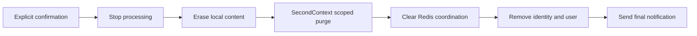

# Account deletion

`/delete_me` and `/delete-me` open the same deterministic confirmation flow, including
before consent or after withdrawal. The first command changes no profile or consent.
A sender-scoped random confirmation token expires after 15 minutes. Reopening the
command replaces the token; Cancel removes the pending request. Plain text cannot
confirm deletion. Confirmation commits `users.deleted_at` and a durable job under
the same owner lock used by conversation, consent and profile writes.

Once confirmed, normal ingress and queued conversation work are blocked. An operation
already holding the owner lock finishes before confirmation can commit. The final
notification is sent after cleanup; unavailable dependencies can delay it. Cancellation
is only available before confirmation.



## Durable recovery

Migration `0008` adds `deletion_jobs` and permits inbound receipts without an owner.
Jobs progress through `confirmation`, `requested`, `local_deleted`, `context_deleted`,
`redis_deleted`, `completed`. Each transition commits independently. A failed or
ambiguous step is safe to repeat; a crash after a successful external call but before
commit repeats that idempotent call. No remote service's database is accessed.

`make worker` scans PostgreSQL directly for up to four due deletion jobs concurrently
before publishing ordinary events. Recovery therefore still erases local content and
calls SecondContext when Redis is down. Job row locks prevent concurrent step execution;
each attempt has a 60-second timeout. Failures store only `deletion_retry`, increment
a counter and back off from 10 seconds to one hour. Deletion has no attempt limit.
Stopped workers resume cleanup on restart. Database failures leave progress durable.

The local step removes encrypted birth profiles, derived charts, encrypted drafts,
consent history and conversation-session mappings, and wipes inbound/reply ciphertext.
The subject purge uses the existing [SecondContext v1 contract](../contracts/second-context/v1.md).
Only its validated subject-specific completion acknowledgement advances the job.
Unsupported purge, failed authentication, wrong-scope replies and dependency outages
never count as deletion success. The external subject configuration must remain stable
throughout the account's lifetime and deletion.

The Redis step removes the existing `oria:user:<uuid>:conversation-lock` key. Shared
Dramatiq queues contain only event UUIDs; stale jobs become harmless through terminal
PostgreSQL receipts. An already-started worker can briefly recreate the expiring lock,
but rechecks canonical state before processing and releases it without accessing data.
Future user-owned Redis keys must be added to this cleanup explicitly.

Final cleanup uses the same admission lock as ingress, detaches inbound receipts,
removes the Telegram mapping and hard-deletes the user. It encrypts the final reply
address and marks cleanup complete atomically. Sending the fixed final message never
resolves or creates an account. A send failure retries independently for up to 24 hours
after completion; the next worker scan erases the address after expiry. A crash after
Telegram accepted the message can duplicate this notice. Delivery failure cannot undo
deletion. A subsequent `/start` creates a fresh UUID and requires fresh consent.

## Retained records and limits

- Completed jobs retain internal subject/job UUIDs, progress, timestamps, retry count
  and bounded failure code. There is no foreign key to a live user, profile content,
  confirmation token or routing address after notification cleanup.
- Inbound receipts retain event/update identifiers, sequence, timestamps and terminal
  bookkeeping, without user association or encrypted payloads. Ingress checks receipts
  before identity resolution, so replay of an accepted old update cannot recreate an
  account or repeat its consent decision. A newly clicked old button is a new update,
  but its token cannot authorize deletion of a new account.
- SecondContext retains its minimal subject/timestamp fence against delayed writes.
- Backups, retired indexes, upstream AI-provider retention and Telegram chat history
  have separate lifecycles. This workflow does not claim to erase those copies.
- Active deletion retains the old routing identity until dependencies acknowledge
  cleanup. Unsupported/misconfigured purge requires operator repair; it is never skipped.

## Demo setup and verification

Run `make migrate`, set `ORIA_POLICY_VERSION=2026-10-03.2` (bump custom versions too),
and restart polling and workers consistently. Existing accepted users re-consent for
chat, but deletion itself requires no consent. Keep encryption keys available until
pending final notifications have been delivered or expired.

SecondContext must support authenticated purge; see [service setup](second-context.md).
An unauthenticated instance that can answer chat may still reject purge. Do not change
subject namespaces to bypass that failure: doing so would target a different subject.

For payload-free operator inspection:

```sql
SELECT status, count(*) FROM deletion_jobs GROUP BY status;
SELECT id, status, attempts, failure_code, next_attempt_at
FROM deletion_jobs WHERE status NOT IN ('confirmation', 'completed');
```

`tests/integration/test_deletion.py` exercises the production flow with isolated
PostgreSQL/Redis, mocked Telegram delivery, and the stateful SecondContext HTTP contract
stub. Existing contract tests cover strict purge responses; upstream implementation
evidence is recorded with Stage 12. This is not a live deployment purge check. Run
`make verify`; see [Stage 18 evidence](evidence/stage-18.md).

Development downgrade discards unlinked receipts and deletion jobs; it cannot restore
deleted accounts or remote context and must not be used to cancel an active deletion.
