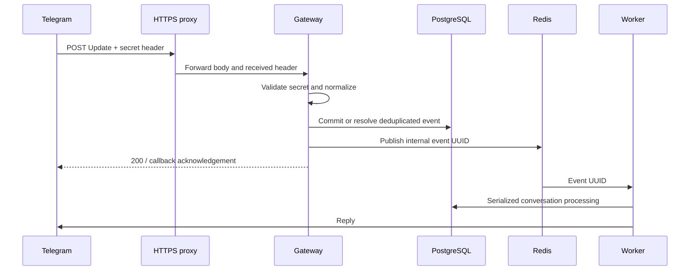

# Production Telegram webhook

`make api` serves `POST /telegram/webhook` on `127.0.0.1:8001`. The gateway validates
the secret, normalizes supported private updates, commits/deduplicates PostgreSQL
admission, publishes the event UUID to Redis and returns. The existing worker owns
consent, onboarding, interpretation and outbound replies. See the
[ingress contract](../contracts/telegram/webhook-v1.md) and [worker queue](worker-queue.md).

## Setup and transition

1. Use migrated PostgreSQL (`make migrate`, current revision `0008`) and Redis,
   and the stable encryption key and policy version used by the workers. Active
   interpretation also needs the existing [SecondContext](second-context.md) and
   [astrology MCP](astrology-mcp.md) configuration. This stage adds no migration,
   dependency or new consent disclosure.
   Keep the same bot/database configuration across gateway and workers; the
   existing queue supports one bot per database.
2. Configure secrets privately through the deployment environment. Use
   `APP_ENV=production`, explicit service URLs, `TELEGRAM_BOT_TOKEN`,
   `PROFILE_ENCRYPTION_KEY`, `ORIA_POLICY_VERSION=2026-10-03.2` (or your current
   custom version), `TELEGRAM_WEBHOOK_BASE_URL=https://bot.example.com` and a random
   `TELEGRAM_WEBHOOK_SECRET`. The secret accepts 1–256 letters, digits, `_` or `-`;
   prefer at least 32 random bytes encoded as URL-safe text. Do not put values in
   command arguments, commits, logs, evidence or chat.
3. Start `make worker` and `make api` with matching settings. A nonempty webhook
   secret enables the route in development/test too; an empty secret keeps the
   local HTTP skeleton independent. Enabled ingress fails before listening if the
   token, encryption key or disclosure is missing/outdated. `/readyz` now checks
   database and Redis connectivity; it does not verify schema, remote service
   capabilities, TLS, worker availability or Telegram credentials.
4. Put an HTTPS reverse proxy in front of the loopback listener, with a valid
   publicly trusted certificate. The public URL must reach the route without a
   redirect or another authentication challenge. The base URL can include a prefix:
   `https://bot.example.com/oria` registers `/oria/telegram/webhook`; the proxy must
   map it to the internal `/telegram/webhook` path.
5. Stop polling for this bot, then run `make webhook-set`. This is the explicit
   live registration action. The command supplies the configured secret and
   `allowed_updates=["message","callback_query"]`, preserves pending updates,
   bounds the API call to 20 seconds, and prints only a generic confirmation.
   Start-up never registers or deletes webhooks automatically.
6. Use synthetic data to send `/start` and test the consent buttons and worker
   reply. Check operational status and `/readyz` locally. No automatic check in
   this repository contacts a live Telegram bot or proves the public TLS path.

Telegram retries unsuccessful HTTP responses, and polling cannot receive updates
while a webhook is registered. These behaviors and registration parameters follow
the [Telegram Bot API](https://core.telegram.org/bots/api#setwebhook).

## Proxy and TLS

[deploy/nginx.webhook.conf.example](../deploy/nginx.webhook.conf.example) shows a
same-host proxy. Replace its hostname/certificate paths and validate it with your
installed Nginx before using it. The example has not been deployed or TLS-tested.
Production containers/network configuration remain Stage 23 work.

Expose only HTTPS ingress; keep PostgreSQL, Redis, workers, MCP and SecondContext
private. Forward the **received** secret header; never inject the configured secret
at the proxy, which would authenticate arbitrary internet requests. Disable
request/header/body logging, tracing captures and caching at every public hop.
Keep proxy body limits consistent with the 256-KiB application limit. Proxy timeouts
should allow the gateway's 5-second admission deadline to return a controlled error.
Use no URL tokens. Keep `/healthz` and `/readyz` available only to trusted checks.

The supported launcher binds loopback and retains privacy logging with Uvicorn
access logs disabled. A container proxy on another host needs an explicit private
listener/network configuration; do not expose an unauthenticated upstream.

## Failure and retry behavior

Missing, wrong or duplicate secrets return 403 before body parsing. Malformed
authenticated input returns a fixed 400; oversized input returns 413, including
chunked bodies. Unsupported updates return 200 without identities or event rows.
Existing deletion fences reject normal admission without restoring deleted state.

Database or queue failure and deadline expiry return fixed 503 responses. If an
event committed before publication failed, worker scans still recover it. Telegram
retries reuse the same receipt, and repeated UUID jobs do not repeat completed
domain changes. Redis publication runs in a thread with socket timeouts and may
finish after cancellation; duplicate publication is safe. Ordering and remote
at-least-once effects retain the worker's existing limits.

Supported callbacks return an `answerCallbackQuery` method in the HTTP response,
after admission/publication. This avoids another network call on ingress. As
[Telegram documents](https://core.telegram.org/bots/faq#how-can-i-make-requests-in-response-to-updates),
OriaEngine cannot observe whether that acknowledgement succeeds. Conversation
replies still use the durable worker delivery path.

## Delete, reset and development polling

`make webhook-delete` removes registration while preserving pending updates.
`make webhook-reset` reapplies the configured URL, secret and allowed update types;
use it after a URL/secret change with the corresponding gateway configuration.
Both commands require explicit invocation and neither removes Oria account data.
Only when deliberate, use
`uv run python -m oria_engine.telegram.webhook_admin delete --drop-pending-updates`
to irreversibly discard Telegram's pending updates. The same opt-in flag is available
for set/reset, but Make targets always preserve pending updates.

For local polling, use a development bot with no active webhook and
`APP_ENV=development`; then run `make run` and `make worker`. Polling rejects
production settings and active webhooks and never clears registration automatically.

## Verification

Unit/HTTP contract checks cover authentication before parsing, safe errors, body
limits, unsupported events, command parity, callbacks, lifecycle, readiness and
management API parameters/cleanup. Isolated PostgreSQL/Redis tests cover concurrent
duplicates, actual UUID-only broker messages, domain idempotency, durable queue
failure recovery, database retry, privacy minimization and dependency readiness.
See [Stage 19 evidence](evidence/stage-19.md).
