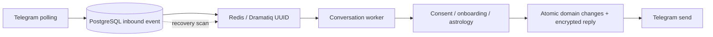

# Redis worker queue and user serialization

Polling accepts normalized private Telegram input, resolves its trusted sender and
commits an `inbound_events` row before enqueueing. A unique `(provider,
provider_update_id)` constraint makes redelivery return the existing UUID. Dramatiq
messages contain only that UUID. This baseline supports one Telegram bot per database;
separate bots require separate databases until provider-account scoping is added.



## Run the demo

Use identical `.env` configuration for polling and workers. Set
`ORIA_POLICY_VERSION=2026-10-03.1` (bump custom versions too), retain the encryption
key, and configure `DATABASE_URL`, `REDIS_URL`, `TELEGRAM_BOT_TOKEN` and
`ASTROLOGY_MCP_URL=http://localhost:8000/mcp`.

```sh
make infra-up
make migrate
make mcp-local
make worker
# In another terminal:
make run
```

`make worker` runs four Dramatiq threads and a recovery scan every five seconds.
No dependency was added. Each job owns its event loop, database pool, Redis connection
and Telegram session; these close after processing. SIGINT/SIGTERM stop recovery and
drain workers. Restarting the worker recovers pending events from PostgreSQL.
The HTTP skeleton and future webhook deployment remain separate.

## Canonical state, retries and ordering

Migration `0006` creates UUID, owner, provider update ID, sequence, status, attempts,
creation/expiry timestamps, retry deadline, encryption key version, encrypted input
and reply, and a bounded failure code. No exception strings or raw payloads enter
status fields or logs. PostgreSQL identity sequences order admitted events per user;
a separate short PostgreSQL advisory lock serializes admission commits per user.
This is admission order, not reconstruction of missing or delayed provider updates.

| Status | Meaning |
| --- | --- |
| `pending` | Awaiting first attempt or retry |
| `processing` | Attempt claimed; unfinished after a crash |
| `ready` | Domain transaction committed; reply awaiting delivery |
| `sent` | Send returned successfully; payloads erased |
| `dead` | Attempts exhausted, expired, owner unavailable or reply consent changed; payloads erased |

Only the earliest nonterminal event for a user can run. Other users proceed
independently. Redis uses `oria:user:<uuid>:conversation-lock` with a 120-second TTL
and token-checked Lua release via redis-py. A whole attempt has a 60-second async
timeout. PostgreSQL `FOR NO KEY UPDATE` on the owner is the final serialization
fence if Redis is flushed or the lease expires. That lock permits new inbound
foreign-key inserts while slow work is running. Ingress identity resolution does
not take the conversation lock; workers recheck user availability and consent.

A claim increments the durable attempt count before domain work. Its recovery
lease is 150 seconds; crashed attempts become eligible after that deadline. Caught
failures use 10, 20, 40 and 80-second backoffs. Five attempts are the limit, shared
across processing and delivery. Redis lock contention and waiting behind an older
event do not consume attempts. PostgreSQL owns retries; Dramatiq retries are disabled
so a Redis flush cannot reset the attempt budget. Database/Redis outages leave the
event recoverable; dependency downtime need not immediately consume an attempt.

The recovery loop scans up to 100 eligible records at a time and republishes their
UUIDs. Duplicate jobs are harmless. This closes the commit/enqueue gap and restores
jobs after Redis loss, including those never successfully published. No durable
`queued` flag can strand work when Redis disappears. A dead event no longer blocks
later user messages. The user can resend a command or resume with `/start`;
dead payloads cannot be replayed because they have been erased.

Consent/profile changes and the encrypted reply commit in one transaction. A crash
before commit rolls both back. A crash after commit retries the saved reply without
repeating the domain action. Delivery rechecks user availability, policy version and
consent revision. An outdated reply is discarded. Telegram supplies no send
idempotency key: a crash after Telegram accepts a reply but before the `sent` commit
can duplicate that reply. This is not exactly-once Telegram delivery.

## Privacy and retention

Before current consent, ingress discards all free text, including unsolicited birth
values. Only normalized commands and known consent actions survive. Unknown callbacks
become a fixed stale marker. Users should wait for the birth prompt after accepting;
text arriving before that acceptance commits is deliberately discarded.

After consent, bounded input (at most 4096 characters) is temporarily encrypted;
only validated birth fields enter drafts/profiles. Input is erased atomically when
domain processing commits. Pending replies are also encrypted because they may contain
confirmation summaries. Successful delivery and permanent failure erase both envelopes.
Unfinished envelopes expire 24 hours after admission. Cleanup runs with worker scans;
while workers are stopped, expired ciphertext remains until they restart. Backups
require their own retention policy. Deduplication metadata remains until a future
account-deletion/metadata-retention workflow handles it.

Both envelopes use the configured AES-256-GCM profile key with a random nonce and
separate authenticated context: `['oria:event:v1', owner_uuid, event_uuid, kind,
key_version]`, where kind is `input` or `reply`. Ciphertexts cannot be moved across
users, events or payload kinds. Redis receives no input, reply, birth data or routing
IDs. Keep old keys available while their queued payloads remain; multi-key rotation
is not implemented. The policy bump discloses temporary encrypted message storage.

## Operator visibility and limits

Use a trusted PostgreSQL client connected to `DATABASE_URL` for payload-free status:

```sql
SELECT status, count(*) FROM inbound_events GROUP BY status;
SELECT id, status, attempts, failure_code, next_attempt_at
FROM inbound_events WHERE status = 'dead' ORDER BY sequence DESC LIMIT 50;
```

Logs distinguish `queue_unavailable`, `worker_retry`, `worker_dead` and
`worker_lock_lost`; PostgreSQL is the durable source for exhausted/crashed attempts.
Do not export encrypted envelopes or routing IDs when investigating errors.

The baseline keeps bounded external calls under the owner database lock, and stores
short-lived encrypted replies in the inbound row rather than a separate outbox table.
Rate limits, fair scheduling at large queue depth, production containers and metrics
remain later stages. [Stage 16](conversation-worker.md) adds guarded SecondContext
interpretation and documents at-least-once remote effects. This stage introduces no
new published wire contract and does not change astrology MCP v1.

Automated checks use isolated PostgreSQL/Redis, synthetic identities and mocked
Telegram sends, including an actual Dramatiq broker/consumer and production job.
See [verification evidence](evidence/stage-11.md).
